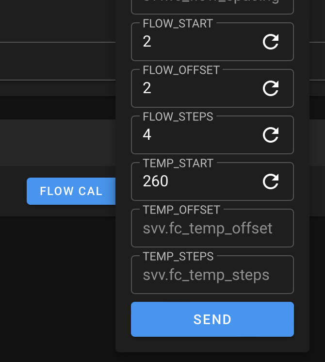

# Flow Calculator

A Klipper macro to extrude blobs that can be weighed and input into the spreadsheet from [CNCKitchens Extrusion Benchmark System](https://github.com/CNCKitchen/ExtrusionSystemBenchmark).

## Installation

If you do not have save_variables setup yet, add the following to `printer.cfg` and copy `saved_variables.cfg` into your `klipper_config` folder.

```
[save_variables]
filename: ~/klipper_config/saved_variables.cfg
```

If it already exists, copy the contents into the existing saved variables file.

Copy the `FLOW_CALC.cfg` macro into your Klipper install and include the macro in `printer.cfg`.

Configure the `saved_variables.cfg` defaults to match your printer and restart Klipper.

## Usage

You can include the macro in other gcode, macros or use directly. When using `FLOW_CAL` directly from Mainsail, parameters can be set each time from the drop down.



Would execute `FLOW_CAL FLOW_START=2 FLOW_OFFSET=2 FLOW_STEPS=4 TEMP_START=260`. This would generate 4 blobs ranging from 2mm3/s to 8mm3/s in increments of 2mm3/s.
